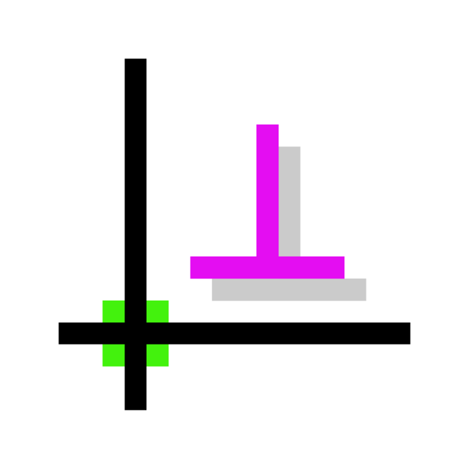

# SolveSpace



[](https://github.com/solvespace/solvespace/actions)
[](https://snapcraft.io/solvespace)
[](https://snapcraft.io/solvespace)

This repository contains the source code of [SolveSpace][], a parametric
2d/3d CAD.

[solvespace]: https://solvespace.com

## Community

The official SolveSpace [website][sswebsite] has [tutorials][sstutorial],
[reference manual][ssref] and a [forum][ssforum]; there is also an official
IRC channel [#solvespace at web.libera.chat][ssirc].

[sswebsite]: http://solvespace.com/
[ssref]: http://solvespace.com/ref.pl
[sstutorial]: http://solvespace.com/tutorial.pl
[ssforum]: http://solvespace.com/forum.pl
[ssirc]: https://web.libera.chat/#solvespace

## Installation

### Via Official Packages

_Official_ release packages for macOS (>=10.6 64-bit) and Windows
(>=Vista 32-bit) are available via [GitHub releases][rel]. These packages are
automatically built by the SolveSpace maintainers for each stable release.

[rel]: https://github.com/solvespace/solvespace/releases

### Via Snap Store

Official releases can be installed from the `stable` channel.

Builds from master are automatically released to the `edge` channel in the Snap
Store. Those packages contain the latest improvements, but receive less testing
than release builds.

[](https://snapcraft.io/solvespace)

Or install from a terminal:

```sh
# for the latest stable release:
snap install solvespace

# for the bleeding edge builds from master:
snap install solvespace --edge
```

### Via automated edge builds

> :warning: **Edge builds might be unstable or contain severe bugs!**
> They are intended for experienced users to test new features or verify bugfixes.

Cutting edge builds from the latest master commit are available as zip archives
from the following links:

- [macOS](https://nightly.link/solvespace/solvespace/workflows/cd/master/macos.zip)
- [Windows](https://nightly.link/solvespace/solvespace/workflows/cd/master/windows.zip)
- [Windows with OpenMP enabled](https://nightly.link/solvespace/solvespace/workflows/cd/master/windows-openmp.zip)

Extract the downloaded archive and install or execute the contained file as is
appropriate for your platform.

### Via source code

See below.

## Building on Linux

### Building for Linux

You will need the usual build tools, CMake, zlib, libpng, cairo, freetype. To
build the GUI, you will need fontconfig, gtkmm 3.0 (version 3.16 or later),
pangomm 1.4, OpenGL and OpenGL GLU, and optionally, the Space Navigator client
library. On a Debian derivative (e.g. Ubuntu) these can be installed with:

```sh
sudo apt install git build-essential cmake zlib1g-dev libpng-dev \
            libcairo2-dev libfreetype6-dev libjson-c-dev \
            libfontconfig1-dev libgtkmm-3.0-dev libpangomm-1.4-dev \
            libgl-dev libglu-dev libspnav-dev
```

On a RedHat derivative (e.g. Fedora) the dependencies can be installed with:

```sh
sudo dnf install git gcc-c++ cmake zlib-devel libpng-devel \
            cairo-devel freetype-devel json-c-devel \
            fontconfig-devel gtkmm30-devel pangomm-devel \
            mesa-libGL-devel mesa-libGLU-devel libspnav-devel
```

Before building, check out the project and the necessary submodules:

```sh
git clone https://github.com/solvespace/solvespace
cd solvespace
git submodule update --init extlib/libdxfrw extlib/mimalloc extlib/eigen
```

After that, build SolveSpace as following:

```sh
mkdir build
cd build
cmake .. -DCMAKE_BUILD_TYPE=Release -DENABLE_OPENMP=ON
make

# Optionally
sudo make install
```

Link Time Optimization is supported by adding `-DENABLE_LTO=ON` to cmake at the
expense of longer build time.

The graphical interface is built as `build/bin/solvespace`, and the command-line
interface is built as `build/bin/solvespace-cli`. It is possible to build only
the command-line interface by passing the `-DENABLE_GUI=OFF` flag to the cmake
invocation.

### Building for Windows

Ubuntu will require 20.04 or above. Cross-compiling with WSL is also confirmed
to work.

You will need the usual build tools, CMake, and a Windows cross-compiler. On a
Debian derivative (e.g. Ubuntu) these can be installed with:

```sh
apt-get install git build-essential cmake mingw-w64
```

Before building, check out the project and the necessary submodules:

```sh
git clone https://github.com/solvespace/solvespace
cd solvespace
git submodule update --init
```

Build 64-bit SolveSpace with the following:

```sh
mkdir build
cd build
cmake .. -DCMAKE_TOOLCHAIN_FILE=../cmake/Toolchain-mingw64.cmake \
            -DCMAKE_BUILD_TYPE=Release
make
```

The graphical interface is built as `build/bin/solvespace.exe`, and the
command-line interface is built as `build/bin/solvespace-cli.exe`.

Space Navigator support will not be available.

## Building on macOS

You will need git, XCode tools, CMake and libomp. Git, CMake and libomp can be installed
via [Homebrew][]:

```sh
brew install git cmake libomp
```

XCode has to be installed via AppStore or [the Apple website][appledeveloper];
it requires a free Apple ID.

Before building, check out the project and the necessary submodules:

```sh
git clone https://github.com/solvespace/solvespace
cd solvespace
git submodule update --init
```

After that, build SolveSpace as following:

```sh
mkdir build
cd build
cmake .. -DCMAKE_BUILD_TYPE=Release -DENABLE_OPENMP=ON
make
```

Link Time Optimization is supported by adding `-DENABLE_LTO=ON` to cmake at the
expense of longer build time.

Alternatively, generate an XCode project, open it, and build the "Release" scheme:

```sh
mkdir build
cd build
cmake .. -G Xcode
```

The application is built in `build/bin/SolveSpace.app`, the graphical interface executable
is `build/bin/SolveSpace.app/Contents/MacOS/SolveSpace`, and the command-line interface executable
is `build/bin/SolveSpace.app/Contents/MacOS/solvespace-cli`.

[homebrew]: https://brew.sh/
[appledeveloper]: https://developer.apple.com/download/

## Building on OpenBSD

You will need git, cmake, libexecinfo, libpng, gtk3mm and pangomm.
These can be installed from the ports tree:

```sh
pkg_add -U git cmake libexecinfo png json-c gtk3mm pangomm
```

Before building, check out the project and the necessary submodules:

```sh
git clone https://github.com/solvespace/solvespace
cd solvespace
git submodule update --init extlib/libdxfrw extlib/mimalloc extlib/eigen
```

After that, build SolveSpace as following:

```sh
mkdir build
cd build
cmake .. -DCMAKE_BUILD_TYPE=Release
make
sudo make install
```

Unfortunately, on OpenBSD, the produced executables are not filesystem location independent
and must be installed before use. By default, the graphical interface is installed to
`/usr/local/bin/solvespace`, and the command-line interface is built as
`/usr/local/bin/solvespace-cli`. It is possible to build only the command-line interface
by passing the `-DENABLE_GUI=OFF` flag to the cmake invocation.

## Building on Windows

You will need [git][gitwin], [cmake][cmakewin] and a C++ compiler
(either Visual C++ or MinGW). If using Visual C++, Visual Studio 2015
or later is required.
If gawk is in your path be sure it is a proper Windows port that can handle CL LF line endings.
If not CMake may fail in libpng due to some awk scripts - issue #1228.

### Building with Visual Studio IDE

Check out the git submodules. Create a directory `build` in
the source tree and point cmake-gui to the source tree and that directory.
Press "Configure" and "Generate", then open `build\solvespace.sln` with
Visual C++ and build it.

### Building with Visual Studio in a command prompt

First, ensure that `git` and `cl` (the Visual C++ compiler driver) are in your
`%PATH%`; the latter is usually done by invoking `vcvarsall.bat` from your
Visual Studio install. Then, run the following in cmd or PowerShell:

```bat
git clone https://github.com/solvespace/solvespace
cd solvespace
git submodule update --init
mkdir build
cd build
cmake .. -G "NMake Makefiles" -DCMAKE_BUILD_TYPE=Release
nmake
```

### Building with MinGW

It is also possible to build SolveSpace using [MinGW][mingw], though
Space Navigator support will be disabled.

First, ensure that git and gcc are in your `$PATH`. Then, run the following
in bash:

```sh
git clone https://github.com/solvespace/solvespace
cd solvespace
git submodule update --init
mkdir build
cd build
cmake .. -DCMAKE_BUILD_TYPE=Release
make
```

[gitwin]: https://git-scm.com/download/win
[cmakewin]: http://www.cmake.org/download/#latest
[mingw]: http://www.mingw.org/

## Contributing

See the [guide for contributors](CONTRIBUTING.md) for the best way to file issues, contribute code,
and debug SolveSpace.

## License

SolveSpace is distributed under the terms of the [GPL v3](COPYING.txt) or later.
